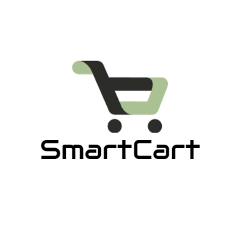

<!-- PROJECT LOGO -->
 

  
 
  <li>
      <a href="#Demo">View Demo</a>
      </li>
    

<!-- <h3 align="center">SmartCart</h3> -->

  <!-- 

    project_description
     
    
  
 -->

<!-- TABLE OF CONTENTS -->

  
Table of Contents

  <ol>
    <li>
      <a href="#about-the-project">About The Project</a>
      <ul>
        <li><a href="#Features">Features</a></li>
      </ul>
      <ul>
        <li><a href="#built-with">Built With</a></li>
      </ul>
    </li>
    <li>
      <a href="#Demo">Demo Video</a>
      </li>
  </ol>

<!-- ABOUT THE PROJECT -->
## About The Project

<!-- [![Product Name Screen Shot][product-screenshot]](https://example.com) -->

SmarCart is an e-commerce application built to provide users with a seamless shopping experience. It offers a wide range of products across various categories, allowing users to browse, search, and purchase items effortlessly.

## Features

### User Authentication
- Secure user authentication system allowing users to sign up, log in, and manage their accounts.

### Product Catalog
- Extensive catalog of products with detailed information and images.

### Shopping Cart
- User-friendly shopping cart functionality for adding and managing items before checkout.

### Order Management
- Seamless order management system for tracking orders and order history.

### Wishlist
- Save favorite items for future reference.

### Note
I have used Provider and BLoC for state management in the same app to achieve features like local-state (Provider) management and global-state (BLoC) management. Provider is a simple and flexible state management solution for managing local-state within widgets. You can use Provider to manage the state of individual widgets or small parts of your UI. In this project, I have used Provider mainly for managing user state. BLoC is a state management pattern that separates the business logic from the UI. It's typically used for managing global application state and handling complex asynchronous operations. In this project, I have used bloc managing state of product and order. The bloc can fetch product data from an API and hold it in memory, allowing multiple widgets to access and display the same data without needing to refetch it. To integrate Provider and BLoC in the same app, I have used Provider to provide BLoCs to your widgets. 

The backend of SmartCart is deployed on Vercel, a cloud platform offering serverless functions and static site hosting.

### Built With
* 
* 
* 
* 

## Demo
https://github.com/DhruvGandhi31/SmartCart/assets/96539582/3b9b6e87-5b78-497b-939f-b26503d84967
